<div align="center">

# 🎓 CNHS Smart Attendance Management System

<p align="center">
  
</p>

<p align="center">
  <strong>Next-Generation RFID Attendance Tracking for Modern Education</strong>
</p>

<p align="center">
  <a href="#sparkles-features"></a>
  <a href="#rocket-quick-start"></a>
  <a href="#camera-gallery"></a>
  <a href="#books-docs"></a>
</p>

<p align="center">
  
  
  
  
  
  
</p>

<p align="center">
  
  
  
</p>

<br/>

```ascii
╔══════════════════════════════════════════════════════════════════════════════╗
║                                                                              ║
║   🏫 Concepcion National High School - Region VII, Central Visayas          ║
║   📍 Concepcion, Mabini, Bohol                                              ║
║   ⚡ Real-time • 📊 Analytics • 🎴 RFID-Powered • 📱 Responsive             ║
║                                                                              ║
╚══════════════════════════════════════════════════════════════════════════════╝
```

</div>

---

## 📋 Table of Contents

- [About](#-about)
- [Features](#-features)
- [Tech Stack](#-tech-stack)
- [System Requirements](#-system-requirements)
- [Installation](#-installation)
- [Configuration](#-configuration)
- [Usage](#-usage)
- [Screenshots](#-screenshots)
- [Database Schema](#-database-schema)
- [API Endpoints](#-api-endpoints)
- [Contributing](#-contributing)
- [License](#-license)
- [Contact](#-contact)

---

## 💡 About The Project

<table>
<tr>
<td width="60%">

The **CNHS Smart Attendance Management System** is a cutting-edge, real-time attendance solution that revolutionizes how educational institutions track and manage student attendance. Built with modern web technologies and RFID integration, this system provides instant insights, powerful analytics, and seamless user experience.

### 🎯 Mission
To eliminate manual attendance tracking, reduce administrative overhead, and provide real-time insights into student attendance patterns through innovative RFID technology.

### 🌟 What Makes It Smart?

- **Instant Recognition** - Sub-second RFID card processing
- **Live Updates** - WebSocket-like real-time data refresh
- **Intelligent Analytics** - AI-powered attendance pattern detection
- **Zero Paper** - Fully digital attendance tracking
- **Mobile First** - Responsive design that works anywhere
- **Offline Ready** - Continues working even with limited connectivity

```mermaid
graph TD
    A[👨‍🎓 Student] -->|Tap Card| B[🎴 RFID Reader]
    B -->|Scan Data| C[💻 System]
    C -->|Record| D[(📊 Database)]
    C -->|Notify| E[🔔 Real-time Update]
    D -->|Generate| F[📈 Reports]
    E -->|Display| G[🖥️ Dashboard]
```

</td>
<td width="40%">



<div align="center">


</div>

</td>
</tr>
</table>

---

## ✨ Features

<div align="center">

### 🎯 Core Capabilities

</div>

<table>
<tr>
<td width="50%">

### 🎴 RFID Integration
```
┌─────────────────────────────┐
│  ⚡ Lightning Fast Check-in │
│  🔒 Secure Card Validation  │
│  📱 HID-Compatible Readers  │
│  🔊 Audio Feedback System   │
│  ✨ Visual Scan Animations  │
└─────────────────────────────┘
```

**Experience:**
- < 1 second check-in time
- Instant visual & audio confirmation
- Contactless operation
- Works with standard RFID readers

</td>
<td width="50%">

### 📊 Real-Time Dashboard
```
┌─────────────────────────────┐
│  📈 Live Statistics         │
│  🔄 Auto-Refresh (30s)      │
│  📉 Trend Analytics         │
│  🎨 Interactive Charts      │
│  📱 Mobile Responsive       │
└─────────────────────────────┘
```

**Insights:**
- Total students present/absent
- Attendance rate percentage
- 7-day trend analysis
- Grade-level breakdown

</td>
</tr>
<tr>
<td width="50%">

### 📋 Smart Reporting
```
┌─────────────────────────────┐
│  📄 PDF Export              │
│  🎯 Custom Date Ranges      │
│  🏫 Grade-Level Filtering   │
│  📊 Visual Analytics        │
│  🖨️ Print-Ready Format      │
└─────────────────────────────┘
```

**Reports Include:**
- Present students list
- Attendance summary
- Grade-level breakdown
- Trend analysis charts
- Professional DepEd branding

</td>
<td width="50%">

### 👥 Student Management
```
┌─────────────────────────────┐
│  ➕ Add/Edit Students       │
│  📇 LRN Tracking            │
│  🎴 RFID Assignment         │
│  📊 Bulk Import/Export      │
│  🔍 Advanced Search         │
└─────────────────────────────┘
```

**Management:**
- Individual student profiles
- Grade 7-12 support
- RFID card management
- CSV import/export
- Attendance history

</td>
</tr>
</table>

<div align="center">

### 🎨 User Experience Features

</div>

<table>
<tr>
<td align="center" width="25%">

<br/>
<strong>Live Clock</strong>
<br/>
<sub>Real-time date & time display with automatic timezone detection</sub>
</td>
<td align="center" width="25%">

<br/>
<strong>Sound Effects</strong>
<br/>
<sub>Customizable audio notifications for check-in confirmation</sub>
</td>
<td align="center" width="25%">

<br/>
<strong>Interactive Charts</strong>
<br/>
<sub>Line & bar graphs with Chart.js for visual analytics</sub>
</td>
<td align="center" width="25%">

<br/>
<strong>Auto-Refresh</strong>
<br/>
<sub>Background data updates every 30 seconds without interruption</sub>
</td>
</tr>
</table>

<details>
<summary><b>📱 View All Features (Click to Expand)</b></summary>

<br/>

#### 🔐 Authentication & Security
- ✅ Secure login system
- ✅ Role-based access control
- ✅ Session management
- ✅ Password encryption
- ✅ CSRF protection

#### 📊 Advanced Analytics
- ✅ Attendance rate calculation
- ✅ Perfect attendance tracking
- ✅ Late arrival monitoring
- ✅ Absence pattern analysis
- ✅ Custom date range reports

#### 🎨 UI/UX Excellence
- ✅ Smooth animations & transitions
- ✅ Loading states & spinners
- ✅ Toast notifications
- ✅ Modal dialogs
- ✅ Responsive tables
- ✅ Scrollable lists with preserved position
- ✅ Progress indicators
- ✅ Color-coded status badges

#### 📄 Export & Printing
- ✅ PDF generation with school logos
- ✅ Professional report layouts
- ✅ Custom date ranges
- ✅ Grade-level filtering
- ✅ Summary statistics
- ✅ Print-optimized formatting

#### 🔔 Notifications & Alerts
- ✅ Real-time check-in alerts
- ✅ Sound notifications (toggleable)
- ✅ Visual scan animations
- ✅ Success/error messages
- ✅ System status indicators

</details>

---

## 🛠️ Tech Stack

<div align="center">

### Built with Modern Technologies

</div>

<table>
<tr>
<td align="center" width="33%">

### 🔴 Backend


**Framework & Language**
- Laravel 10.x
- PHP 8.2+
- MySQL 8.0+
- Composer 2.x

**Key Packages**
- `barryvdh/laravel-dompdf` - PDF Generation
- `carbon` - Date/Time Handling
- `intervention/image` - Image Processing

</td>
<td align="center" width="33%">

### 🎨 Frontend


**UI Framework**
- Bootstrap 5.3
- Blade Templates
- Vanilla JavaScript
- Chart.js 4.4.1

**Design Tools**
- Bootstrap Icons
- SweetAlert2
- Custom CSS Animations
- Responsive Grid System

</td>
<td align="center" width="33%">

### ⚡ DevOps


**Development Tools**
- Git Version Control
- NPM Package Manager
- VS Code
- Laravel Mix

**Deployment**
- Apache/Nginx
- Ubuntu Server
- SSL/TLS Support

</td>
</tr>
</table>

<div align="center">

### 📦 Core Dependencies

</div>

```json
{
  "backend": {
    "laravel/framework": "^10.0",
    "php": "^8.2",
    "barryvdh/laravel-dompdf": "^2.0",
    "intervention/image": "^2.7"
  },
  "frontend": {
    "bootstrap": "^5.3.0",
    "chart.js": "^4.4.1",
    "sweetalert2": "^11.0",
    "@popperjs/core": "^2.11"
  },
  "devDependencies": {
    "laravel-mix": "^6.0",
    "sass": "^1.69",
    "autoprefixer": "^10.4"
  }
}
```

<details>
<summary><b>🔧 View Full Technology Stack</b></summary>

<br/>

#### Backend Architecture
- **MVC Pattern** - Model-View-Controller architecture
- **Eloquent ORM** - Database abstraction layer
- **Blade Engine** - Server-side template rendering
- **Middleware** - Request filtering & authentication
- **Validation** - Form & data validation
- **Queue System** - Background job processing

#### Frontend Technologies
- **Chart.js** - Interactive data visualization
- **Bootstrap Icons** - 1,800+ icon library
- **SweetAlert2** - Beautiful alert modals
- **Vanilla JS** - Zero framework overhead
- **CSS Grid & Flexbox** - Modern layouts
- **CSS Animations** - Smooth transitions

#### Database & Storage
- **MySQL 8.0+** - Relational database
- **InnoDB Engine** - ACID compliance
- **Foreign Keys** - Referential integrity
- **Indexes** - Optimized queries
- **Migrations** - Version control for DB

#### Development Tools
- **Composer** - PHP dependency manager
- **NPM** - JavaScript package manager
- **Laravel Mix** - Asset compilation
- **Git** - Version control
- **Artisan CLI** - Laravel command-line

</details>

---

## 💻 System Requirements

### Minimum Requirements
- **PHP:** 8.1 or higher
- **Composer:** 2.x
- **MySQL:** 8.0 or higher
- **Web Server:** Apache/Nginx
- **Node.js:** 16.x or higher (for asset compilation)
- **NPM:** 8.x or higher

### Recommended Requirements
- **PHP:** 8.2
- **RAM:** 2GB minimum
- **Storage:** 1GB free space
- **RFID Reader:** USB RFID card reader (HID-compliant)

---

## 🚀 Quick Start

<div align="center">

### Get Up and Running in 10 Minutes

</div>

<table>
<tr>
<td width="50%">

### ⚡ Prerequisites

Before you begin, ensure you have:

- [x] **PHP 8.2+** installed
- [x] **Composer 2.x** installed
- [x] **MySQL 8.0+** running
- [x] **Node.js 16+** & NPM 8+
- [x] **Git** for version control
- [x] **RFID Reader** (USB HID-compatible)

<details>
<summary>💡 Check Versions</summary>

```bash
php --version
composer --version
mysql --version
node --version
npm --version
git --version
```
</details>

</td>
<td width="50%">

### 📋 System Requirements

| Component | Minimum | Recommended |
|-----------|---------|-------------|
| **PHP** | 8.1 | 8.2+ |
| **RAM** | 2GB | 4GB+ |
| **Storage** | 1GB | 5GB+ |
| **MySQL** | 8.0 | 8.0+ |
| **CPU** | 2 Core | 4 Core+ |

**Supported Platforms:**
- ✅ Ubuntu 20.04+
- ✅ Windows 10/11
- ✅ macOS 11+
- ✅ Debian 11+

</td>
</tr>
</table>

---

### 📥 Installation Steps

<details open>
<summary><b>Step 1️⃣: Clone Repository</b></summary>

<br/>

```bash
# Clone the repository
git clone https://github.com/yourusername/cnhs-attendance.git

# Navigate to project directory
cd cnhs-attendance
```

**Alternative:** Download ZIP from GitHub
```bash
wget https://github.com/yourusername/cnhs-attendance/archive/main.zip
unzip main.zip
cd cnhs-attendance-main
```

</details>

<details open>
<summary><b>Step 2️⃣: Install Dependencies</b></summary>

<br/>

**PHP Dependencies:**
```bash
composer install --optimize-autoloader --no-dev
```

**Node Dependencies:**
```bash
npm install
```

**Optional - Development Dependencies:**
```bash
composer install  # Include dev packages
npm install --save-dev
```

</details>

<details open>
<summary><b>Step 3️⃣: Environment Setup</b></summary>

<br/>

**Create Environment File:**
```bash
cp .env.example .env
```

**Generate Application Key:**
```bash
php artisan key:generate
```

**Configure Database** - Edit `.env`:
```env
APP_NAME="CNHS Smart Attendance"
APP_ENV=production
APP_DEBUG=false
APP_URL=http://localhost

DB_CONNECTION=mysql
DB_HOST=127.0.0.1
DB_PORT=3306
DB_DATABASE=cnhs_attendance
DB_USERNAME=your_username
DB_PASSWORD=your_password

SCHOOL_NAME="Concepcion National High School"
SCHOOL_ADDRESS="Concepcion, Mabini, Bohol"
```

</details>

<details open>
<summary><b>Step 4️⃣: Database Migration</b></summary>

<br/>

**Create Database:**
```bash
mysql -u root -p
CREATE DATABASE cnhs_attendance CHARACTER SET utf8mb4 COLLATE utf8mb4_unicode_ci;
EXIT;
```

**Run Migrations:**
```bash
php artisan migrate --seed
```

**Optional - Fresh Migration:**
```bash
php artisan migrate:fresh --seed
```

</details>

<details open>
<summary><b>Step 5️⃣: Build Assets</b></summary>

<br/>

**Development Build:**
```bash
npm run dev
```

**Production Build:**
```bash
npm run build
```

**Watch for Changes (Development):**
```bash
npm run watch
```

</details>

<details open>
<summary><b>Step 6️⃣: Storage Setup</b></summary>

<br/>

**Create Storage Link:**
```bash
php artisan storage:link
```

**Set Permissions (Linux/Mac):**
```bash
chmod -R 775 storage bootstrap/cache
```

</details>

<details open>
<summary><b>Step 7️⃣: Launch Application</b></summary>

<br/>

**Development Server:**
```bash
php artisan serve
```

**Custom Host/Port:**
```bash
php artisan serve --host=0.0.0.0 --port=8080
```

**Access Application:**
```
🌐 http://localhost:8000
```

**Default Credentials:**
```
📧 Email: admin@cnhs.edu
🔑 Password: password
```

</details>

---

### 🎯 Quick Commands

```bash
# Clear cache
php artisan cache:clear
php artisan config:clear
php artisan view:clear

# Optimize for production
php artisan optimize
php artisan config:cache
php artisan route:cache
php artisan view:cache

# Database refresh
php artisan migrate:fresh --seed

# Run tests
php artisan test
```

---

### 🐳 Docker Installation (Optional)

<details>
<summary><b>Click to view Docker setup</b></summary>

<br/>

**Using Docker Compose:**

```yaml
# docker-compose.yml
version: '3.8'
services:
  app:
    build: .
    ports:
      - "8000:80"
    environment:
      - DB_HOST=db
      - DB_DATABASE=cnhs_attendance
      - DB_USERNAME=root
      - DB_PASSWORD=secret
    depends_on:
      - db
  
  db:
    image: mysql:8.0
    environment:
      MYSQL_DATABASE: cnhs_attendance
      MYSQL_ROOT_PASSWORD: secret
    volumes:
      - dbdata:/var/lib/mysql

volumes:
  dbdata:
```

**Run with Docker:**
```bash
docker-compose up -d
docker-compose exec app php artisan migrate --seed
```

</details>

---

## ⚙️ Configuration

### School Information

Update school details in `config/app.php`:

```php
'school_name' => env('SCHOOL_NAME', 'Concepcion National High School'),
'school_address' => env('SCHOOL_ADDRESS', 'Concepcion, Mabini, Bohol'),
```

Or add to your `.env` file:

```env
SCHOOL_NAME="Your School Name"
SCHOOL_ADDRESS="Your School Address"
```

### RFID Reader Configuration

The system works with standard USB RFID readers that act as keyboard input devices. No additional configuration is required.

### Logos

Place your school logos in `public/img/`:
- `cnhs.png` - School logo
- `deped-logo.png` - DepEd logo

---

## 📖 Usage

### For Administrators

1. **Login** to the system using your credentials
2. **Manage Students** - Add, edit, or import student records
3. **Monitor Attendance** - View real-time check-ins on the live monitor
4. **Generate Reports** - Create and export attendance reports

### For Attendance Officers

1. Navigate to **Live Attendance Monitor**
2. Students tap their RFID cards on the reader
3. System automatically records check-in with timestamp
4. View all today's check-ins in the scrollable list
5. Export reports as needed

### Generating Reports

1. Go to **Attendance Reports**
2. Select date range and grade level (optional)
3. Click **Generate Report** to view analytics
4. Click **Export Report** for PDF download

---

## 📸 Gallery

<div align="center">

### Visual Tour of CNHS Smart Attendance

</div>

<table>
<tr>
<td width="50%">

### 🏠 Dashboard


**Real-time Overview**
- Live attendance statistics
- 7-day trend analysis
- Interactive charts
- Today's distribution

</td>
<td width="50%">

### 📡 Live Monitor


**RFID Check-in**
- Real-time scanning
- Instant notifications
- Audio feedback
- Visual animations

</td>
</tr>
<tr>
<td width="50%">

### 📊 Reports


**Analytics & Insights**
- Custom date ranges
- Grade-level filtering
- Trend analysis
- Export options

</td>
<td width="50%">

### 📄 PDF Export


**Professional Reports**
- School branding
- Student listings
- Summary statistics
- Print-ready format

</td>
</tr>
<tr>
<td width="50%">

### 👥 Student Management


**Student Records**
- Add/Edit students
- RFID assignment
- Bulk operations
- Search & filter

</td>
<td width="50%">

### 📱 Mobile View


**Responsive Design**
- Mobile-optimized
- Touch-friendly
- All features accessible
- Fast performance

</td>
</tr>
</table>

<div align="center">

### 🎥 Demo Video

[](https://youtube.com/demo-link)

</div>

---

## 🗄️ Database Schema

### Tables

#### students
- `id` - Primary key
- `lrn` - Learner Reference Number (unique)
- `name` - Student full name
- `grade` - Grade level (7-12)
- `rfid` - RFID card number (unique)
- `created_at` - Record creation timestamp
- `updated_at` - Last update timestamp

#### attendances
- `id` - Primary key
- `student_id` - Foreign key to students
- `date` - Attendance date
- `time_in` - Check-in time
- `status` - Attendance status (present/absent/late)
- `created_at` - Record creation timestamp
- `updated_at` - Last update timestamp

#### users
- `id` - Primary key
- `name` - User name
- `email` - Email (unique)
- `password` - Hashed password
- `role` - User role
- `created_at` - Record creation timestamp
- `updated_at` - Last update timestamp

---

## 🔌 API Endpoints

### Attendance
- `GET /api/attendance/today` - Get today's check-ins
- `POST /attendance/checkin` - Process RFID check-in
- `GET /api/attendance/stats` - Get attendance statistics

### Dashboard
- `GET /api/dashboard/stats` - Get dashboard statistics

### Reports
- `GET /reports/realtime-data` - Get real-time report data
- `GET /reports/export-present` - Export present students PDF

---

## 🤝 Contributing

<div align="center">

### We Welcome Contributions! 🎉

</div>

Contributions make the open-source community an amazing place to learn, inspire, and create. Any contributions you make are **greatly appreciated**.

<table>
<tr>
<td width="50%">

### 🔄 How to Contribute

1. **Fork** the Project
2. **Create** your Feature Branch
   ```bash
   git checkout -b feature/AmazingFeature
   ```
3. **Commit** your Changes
   ```bash
   git commit -m 'Add some AmazingFeature'
   ```
4. **Push** to the Branch
   ```bash
   git push origin feature/AmazingFeature
   ```
5. **Open** a Pull Request

</td>
<td width="50%">

### 📝 Contribution Guidelines

- ✅ Follow PSR-12 coding standards
- ✅ Write meaningful commit messages
- ✅ Add tests for new features
- ✅ Update documentation
- ✅ Comment complex code
- ✅ Keep PRs focused and small

**Areas to Contribute:**
- 🐛 Bug fixes
- ✨ New features
- 📝 Documentation
- 🎨 UI/UX improvements
- ⚡ Performance optimization

</td>
</tr>
</table>

<div align="center">

### 🏆 Top Contributors

<a href="https://github.com/yourusername/cnhs-attendance/graphs/contributors">
  
</a>

</div>

---

## 📄 License

<div align="center">

This project is licensed under the **MIT License**

[](LICENSE)

See [LICENSE](LICENSE) file for details.

**TL;DR** - You can use, copy, modify, merge, publish, distribute, sublicense, and/or sell copies of this software.

</div>

---

## 📞 Contact & Support

<div align="center">

### Get in Touch

</div>

<table>
<tr>
<td width="50%" align="center">

### 🏫 School Information

**Concepcion National High School**

📍 Concepcion, Mabini, Bohol<br/>
🌐 [www.cnhs.edu.ph](https://cnhs.edu.ph)<br/>
📧 info@cnhs.edu.ph<br/>
📞 +63 (38) 123-4567

**Department of Education**<br/>
Region VII - Central Visayas

</td>
<td width="50%" align="center">

### 💻 Development Team

**Project Maintainer**

👤 [Your Name](https://github.com/yourusername)<br/>
📧 developer@example.com<br/>
🐦 [@yourtwitter](https://twitter.com/yourtwitter)

**Report Issues**

🐛 [Bug Report](https://github.com/yourusername/cnhs-attendance/issues/new?template=bug_report.md)<br/>
✨ [Feature Request](https://github.com/yourusername/cnhs-attendance/issues/new?template=feature_request.md)

</td>
</tr>
</table>

<div align="center">

### 💬 Community

[](https://discord.gg/invite-link)
[](https://facebook.com/cnhs)
[](mailto:info@cnhs.edu.ph)

</div>

---

## 🙏 Acknowledgments

<div align="center">

Special thanks to all who made this project possible

</div>

<table>
<tr>
<td align="center" width="25%">
<br/>
<strong>Laravel</strong><br/>
<sub>PHP Framework</sub>
</td>
<td align="center" width="25%">
<br/>
<strong>Bootstrap</strong><br/>
<sub>CSS Framework</sub>
</td>
<td align="center" width="25%">
<br/>
<strong>Chart.js</strong><br/>
<sub>Data Visualization</sub>
</td>
<td align="center" width="25%">
<br/>
<strong>MySQL</strong><br/>
<sub>Database</sub>
</td>
</tr>
</table>

**Organizations:**
- 🏛️ Department of Education - Philippines
- 🌏 DepEd Region VII - Central Visayas
- 🏫 Concepcion National High School
- 👥 Open Source Community

**Contributors:**
- All developers who contributed code
- Testing team and beta users
- Documentation writers
- Community supporters

---

## 📊 Project Stats

<div align="center">


</div>

---

## 🗺️ Roadmap

<details>
<summary><b>📅 View Upcoming Features</b></summary>

<br/>

### Version 2.0 (Q2 2024)
- [ ] Mobile app (iOS & Android)
- [ ] Biometric authentication
- [ ] Parent portal access
- [ ] SMS notifications
- [ ] Advanced AI analytics

### Version 2.5 (Q3 2024)
- [ ] Multi-school support
- [ ] Cloud synchronization
- [ ] API for third-party integration
- [ ] Automated backups
- [ ] Role-based dashboards

### Version 3.0 (Q4 2024)
- [ ] Machine learning predictions
- [ ] Behavioral analytics
- [ ] Integration with LMS
- [ ] Mobile app check-in
- [ ] Advanced reporting engine

</details>

---

<div align="center">

## ⭐ Show Your Support

**If this project helped you, give it a ⭐!**

[](https://github.com/yourusername/cnhs-attendance/stargazers)
[](https://github.com/yourusername/cnhs-attendance/network/members)
[](https://github.com/yourusername/cnhs-attendance/watchers)

</div>

---

<div align="center">

```ascii
╔══════════════════════════════════════════════════════════════════════════════╗
║                                                                              ║
║                   🎓 CNHS Smart Attendance Management System                 ║
║                                                                              ║
║            Empowering Education Through Technology & Innovation              ║
║                                                                              ║
║                    Made with ❤️ in Cebu, Philippines                        ║
║                                                                              ║
║                          © 2024 CNHS. MIT License.                          ║
║                                                                              ║
╚══════════════════════════════════════════════════════════════════════════════╝
```

**[⬆ Back to Top](#-cnhs-smart-attendance-management-system)**

---

<p align="center">
  
  
  
  
</p>

</div>